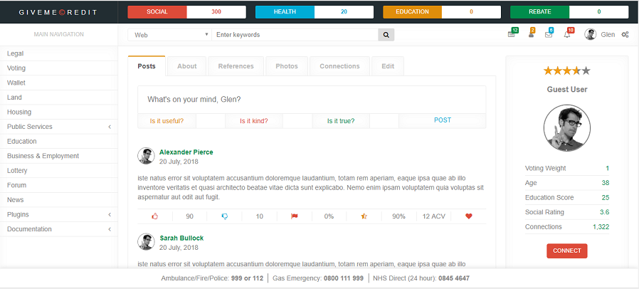
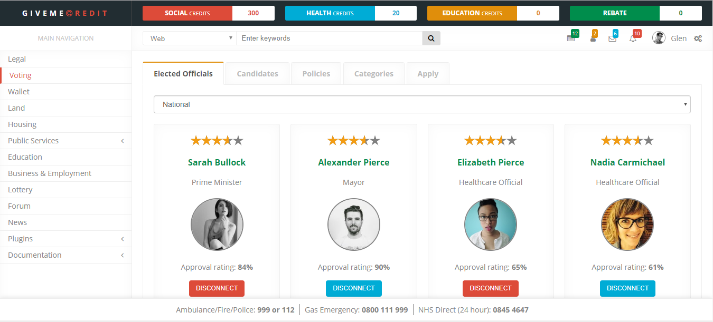
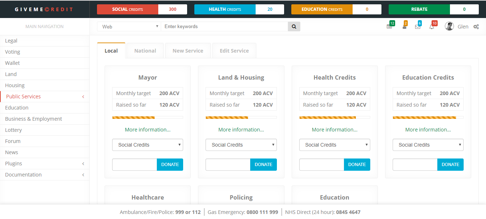
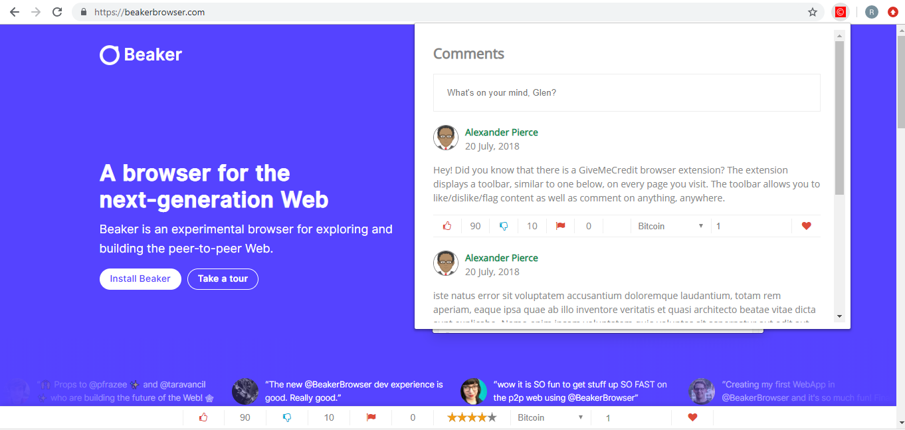

<h3>DEVOLUTION</h3>

<i>“Give a man a fish, he feeds himself for a day. Give a man the means to catch a fish, he feeds himself for a lifetime”</i>

It will take time to finish this application. If you are a developer and would like to help out, I would greatly appreciated it.

The application will be decentralised. I'm developing the UI/prototype, but I still haven't decided which technologies to use yet. I'm particularly interested in Holochain and Maidsafe as they present a more scalable alternative to Ethereum. However, i'm open to suggestions. Perhaps for the prototype I could use GunDB/Beaker Browser and Solid (solid.inrupt.com)

<b>Public Profile:</b>

Each profile has a social rating, which is determined by how you interact with other members on the platform. Each profile has a voting weight, which is calculated based on your age, education score (from the built-in education system) and social rating. 

<b>Universal cryptocurrency wallet: </b>This will be a plug-in. The application uses only cryptocurrencies, and everything is priced in ACV (Average Currency Value).

<b>Direct democracy:</b> Vote on politicians, IT project managers, service providers, policies and polls. 

<b>Land Value Taxation (LVT):</b> Buy, sell and register land, and pay LVT into the application. In order for LVT to be implemented without permission from the state, communities would need to collectively buy the land, divide the land into plots, install the free-standing housing modules (below), and then rent them out to communty members.

IMPORTANT: Revenue from LVT, adverts and the lottery will be redistributed in the form of credits, which include: Social credits, Health Credits, and Education Credits.

<b>Social Credits:</b> When you give your social credits to either a public service, idea or start-up, you get a tax rebate of 10%, which acts as an incentive for users to participate. At the end of each month, any unused Social Credits will be redistributed. 

<b>Health Credits:</b> These can be redeemed by registered private healthcare service providers, and will be used to compliment the NHS. 

<b>Education Credits: </b>These can be redeemed by sitting courses in the built-in education section. Education Credits can also be topped up in the Fund Public Services page.

<b>Affordable housing:</b> Here you can buy affordable, flat-pack, free-standing modular housing units built using aluminium profile technology. You will also be able to buy vertical farm modules and various accessories relating to self-sufficiency (solar panels, water pumps, filters, etc.).

 

<b>Public services: </b>Here elected officials can setup public services. Users can fund public services using their Social Credits. When they donate, they get a 10% rebate.

<b>Business &amp; Employment</b>

<b>GiveMeCredit:</b> Submit ideas, vote on ideas, and receive Social Credits (and recognition) for your ideas. You can also contribute to other peoples ideas, and receive credit for your contributions. 

<b>Crowdfunding:</b> Crowdfund your ideas or donate Social Credits to other peoples ideas. You can only crowdfund an idea that has a minimum of X votes and a minimum positive feedback score of 90%.
 
 
<b>Business search &amp; registration:</b> When you register a business, a business profile will automatically be setup which displays a business representative, transparency score, social rating, consumer/employee reviews, and more. Each business will have an over-all score – similar to the positive feedback score on ebay.

<b>Employment:</b> Advertise jobs, search for employees, search and apply for jobs instantly without any charge.

<b>Education system</b>

The system separates grade-based learning from other learning methods. 

<ul>
<li>Courses are built using the “course builder”.</li>
<li>Courses follow a deterministic pattern. Each section consists of a 2 minute video presentation followed by 3 multiple choice questions. There are 20 sections in a course. Students must score 100% in order to pass. If they fail, they will need to sit the course again.</li>
<li>It is not possible to skip the video presentations.</li>
<li>Students get paid for sitting courses. The amount they get paid depends on the level of the course and the rating.</li>
<li>After you sit a course you are required to review the course.</li>
<li>The level of the course depends on how valuable it is to society.</li>
</ul>

The system also provides a notice board about lectures in your area. 

These are just some of the features. Other sections include healthcare, policing, advertising, community forum, plugins, dating and a lot more.
